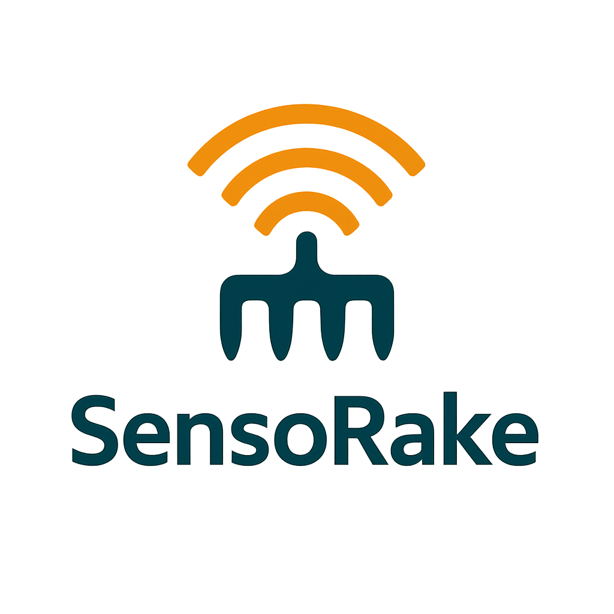

# WIP: SensoRake



This is an early-phase project to learn Rust and to create the foundations of a service that 
- listens to MQTT messages (e.g., weather sensors)
- persists raw data into a data store (DuckLake / DuckDB)
- exposes metrics and mappings for Prometheus scraping
- exposes an admin endpoint to allow creating and mapping from raw sensor identification data (e.g. `id` and `manufacturer`) into logical name like `Bedroom temp sensor`

What this baseline provides
- An async HTTP server (`axum`) with:
	- `PUT /mapping` to create/update sensor mappings (JSON payload: `{ sensor_id, manufacturer, name }`).
	- `GET /mapping` to list mappings.
	- `GET /metrics` to expose Prometheus metrics.
	- A tiny web UI served at `/` to edit mappings (`ui/src/index.html`).
- An MQTT listener stub (uses `rumqttc`) that subscribes to `sensors/#` and increments a Prometheus counter for incoming messages. 
- TODO: persist raw messages into DuckLake/DuckDB.

**Disclosure**: The baseline is created using Github Copilot Pro, as a project to get something done while learning Rust at the same time. Next steps include moving towards human-created and vetted code.

## Design notes & next steps
- Persistence: currently mappings are persisted to `mappings.json` on disk as a simple file-backed placeholder. The plan is to start persisting the mappings into a mapping table in DuckLake/DuckDB-backed storage.
- Data model: mapping records are `{ sensor_id, manufacturer, name }`. The compound key is `manufacturer::sensor_id`.
- UI: the TypeScript sources live under `ui/src` and build output should be placed into `ui/dist` for production. See the `UI organization` section below.

## Running locally
- Build and run the Rust server:
```bash
cargo build
cargo run
```
- The server listens on `http://127.0.0.1:3000/` by default. The UI is available at `/` and the Prometheus metrics at `/metrics`.

UI (development and build)
- Install dependencies (using yarn):
```bash
cd ui
yarn
```
- Start Vite dev server:
```bash
yarn dev
```
- Build static assets for production (outputs to `ui/dist`):
```bash
yarn build
```

## Rust Dependencies
- `anyhow`
- `arrow`
- `axum`
- `chrono`
- `duckdb`
- `http`
- `hyper`
- `prometheus`
- `rumqttc`
- `serde`
- `serde_json`
- `tokio`
- `tower`